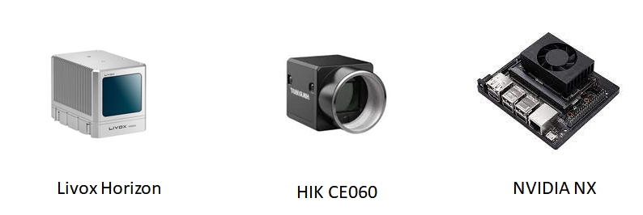

# DeepStream: A Demo for LiDAR-Camera Fusion
DeepStream is an embedded mobile platform equipped with 
[Livox Horizon LiDAR](https://www.livoxtech.com/horizon) and 
[HIK camera](https://www.hikrobotics.com/cn/machinevision/visionproduct?typeId=27&id=42). 
This platform is developed on [Nvidia Jetson Xavier NX](https://www.nvidia.com/en-us/-machines/embedded-systems/jetson-xavier-nx/). 
It will be used to deploy multi-sensor based algorithms in the future.
 

<!----->


Full Demonstration - [Video](https://www.bilibili.com/video/BV1uf4y1L7Jf?spm_id_from=333.337.search-card.all.click)


 
 
# Content

- [DeepStream: A Demo for LiDAR-Camera Fusion](#deepstream-a-demo-for-lidar-camera-fusion)
- [Content](#content)
  - [Environment](#environment)
  - [Calibration Process](#calibration-process)
    - [1. Requirement](#1-requirement)
    - [2. LiDAR Camera Assembly](#2-lidar-camera-assembly)
    - [3. Calibrate Camera Intrinsic and Distortion Matrix](#3-calibrate-camera-intrinsic-and-distortion-matrix)
    - [4. LiDAR Camera Calibration](#4-lidar-camera-calibration)
    - [5. Parameters Setting](#5-parameters-setting)
  - [Running Process](#running-process)
  - [Co-developer](#co-developer)


## Environment

1. OS：Ubuntu 20.04，zsh（oh-my-zsh）

2. Install PyQT5，ROS noetic，anaconda3 (python3.6.13)

3. Install Livox ROS Driver：
    Please refer [official instruction](https://github.com/Livox-SDK/livox_ros_driver)

    If install is successful, the dir should be like:

    ```bash
    |--- path_to_livox_driver/
    |--- devel/
    |--- src/
    |--- build/
    ```

    ```
    cd src/
    ```

    Set `xfer_format` as `2` in the `livox_ros_driver/launch/livox_lidar.launch` （details could be find in the official instruction of livox driver）

 4. Install HIK camera driver：

    Enter [offical web](https://www.hikrobotics.com/machinevision/service/download?module=0 ), and download and extract `机器视觉工业相机客户端MVS V2.1.0 (Linux)`.

    Select the appropriate version to install according to your needs, e.g. `MVS-2.1.0_x86_64_20201228.deb`：

    ```bash
    sudo dpkg -i MVS-2.1.0_x86_64_20201228.deb
    ```

    **Note**: after installation, you could find related files under `/opt/MVS/Samples/64/Python/`, please check this path is correct, or you need to change the imported package path in the `path_to_deepstream/deepstream/hik_cam/hik_cam_linux.py`.


## Calibration Process

We conduct LiDAR-Camera calibration according to [instruction](https://github.com/Livox-SDK/livox_camera_lidar_calibration/blob/master/doc_resources/README_cn.md#%E6%AD%A5%E9%AA%A42-%E7%9B%B8%E6%9C%BA%E5%86%85%E5%8F%82%E6%A0%87%E5%AE%9A).

### 1. Requirement



- [Livox Horizon LiDAR](https://www.livoxtech.com/horizon)
- [Hikvison Camera MV-CE060-10UC](https://www.hikrobotics.com/vision/visioninfo.htm?type=42&oid=2627) + WOLOS 4mm lens  
- [NVIDIA Jetson Xavier NX](https://www.nvidia.com/en-us/autonomous-machines/embedded-systems/jetson-xavier-nx/)(it's also been tested on the laptop)


### 2. LiDAR Camera Assembly


The base connecting the LiDAR to the camera is acrylic plate, you can refer to the following design for customization.

 

  

To mimumize the parameters adjustment during the calibration, it's suggested to follow the following assembly way:


### 3. Calibrate Camera Intrinsic and Distortion Matrix 


**Calibration process(Zhang Zhengyou calibration method):**
1. Initial corner detection
2. Further extract sub-pixel corners
3. Draw corner observations
4. Camera calibration
5. Re-project 3D points in space to evaluate calibration effect

**Data collection:**
We use an 85-inch TV under dark conditions to display the calibration pictures, and collecte 35 frames of pictures from various viewpoints:


**Calibration result -- reprojection error:**
0.014394424473247082 (error within the allowable range)


**Distortion correction results:**


**Note:**
1. Zhang's calibration method is very sensitive to environment. Therefore, we use TV screen display under dark condition as calibration plate.
2. The shooting angle is not diverse enough, and the number of pictures taken is insufficient, both will result in bad accuracy.
3. Exposure intensity needs to be carefully adjusted during shooting, otherwise corner points cannot be captured.

### 4. LiDAR Camera Calibration

**Calibration method:**
Camera LiDAR calibration algorithm based on plane constraint.


**Data collection:**
We use an 1m x 1.5m TV as the calibration board. The distance between sensors and TV is about 3 meters. And collect 15 groups of data.


**Note**: It is very important to overlap multiple frames point cloud data, aka you need to record the `.bag` file for bout 10s, too sparse point cloud will damage the calibration accuracy greatly.
1. It is very important to overlap multiple frames point cloud data, aka you need to record the `.bag` file for bout 10s, too sparse point cloud will damage the calibration accuracy greatly.
2. The accuracy of manually marked corner points of the image is insufficient, resulting in the insufficient accuracy of the annotated image Angle, which affects the accuracy of the external reference annotation. Sub-pixel optimization can be used to further optimize the manually selected pixels to solve the problem.

**Calibration effect:**


### 5. Parameters Setting

Save all params under dir `params`:

```
├─params
│  ├─intrinsic.txt
│  ├─extrinsic.txt
│  └─distort.txt
├─README.md
```


**Example：**

- `distort.txt`
    ```
    -0.09732168794279916 0.1023514279653091 0.0003060722976587038 0.0004451042048329594 -0.01596420627741748 
    ```

- `intrinsic.txt`
    ```
    1723.253969255113 0 1521.018607274423 0 0 1723.714922079786 1029.277181487616 0 0 0 1 0
    ```

- `extrinsic.txt`
    ```
    0.0151031  -0.999863  -0.0068105  -0.0239579 -0.01768  0.00654316  -0.999822  0.0519217 0.99973  0.0152208  -0.0175788  -0.0108779 0  0  0
    ```

    **Note**: These params cannot be perfectly adapted in your case, due to equipment and assembly difference, so you need to calibrate yourself.


## Running Process

1. Open linux terminal，start ROS
    ```bash
    roscore
    ```

2. Connect your laptop or development board with camera by usb.

3. Connect your laptop or development board with LiDAR by network port, and change IP to 192.168.1.50, more details could be found in the offcial instruction.

4. Run LiDAR driver
    ```bash
    cd path_to_livox_driver/
    source devel/setup.zsh # if you use bash，you should replace it with devel/setup.bash
    roslaunch livox_ros_driver livox_lidar_msg.launch
    ```

5. Change camera-related path in `deepstream/hik_cam.py`.
    ```python
    # append dll path
    ## aarch64 
    #sys.path.append("/opt/MVS/Samples/aarch64/Python/MvImport") 
    ## 64-bit Linux
    sys.path.append("/opt/MVS/Samples/64/Python/MvImport") 
    ```
  
  
  
6. Run the main program. If you use the development board, please select the **dual core** running mode, or it will very slow.
    ```
    python3 application.py
    ```


## Co-developer

- [Iris](https://github.com/iris0329)

