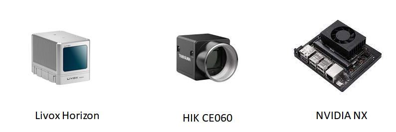
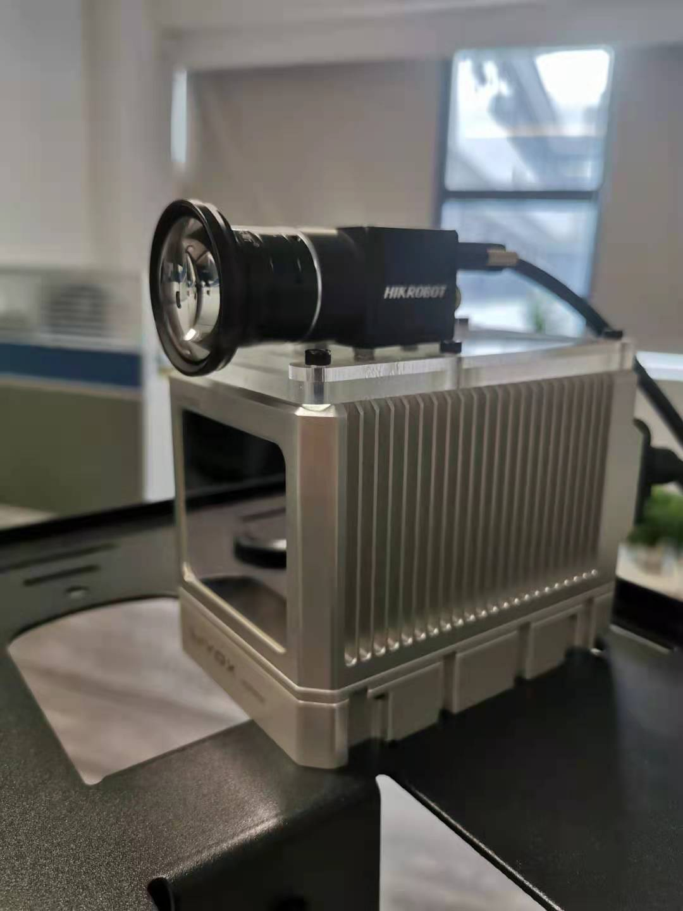
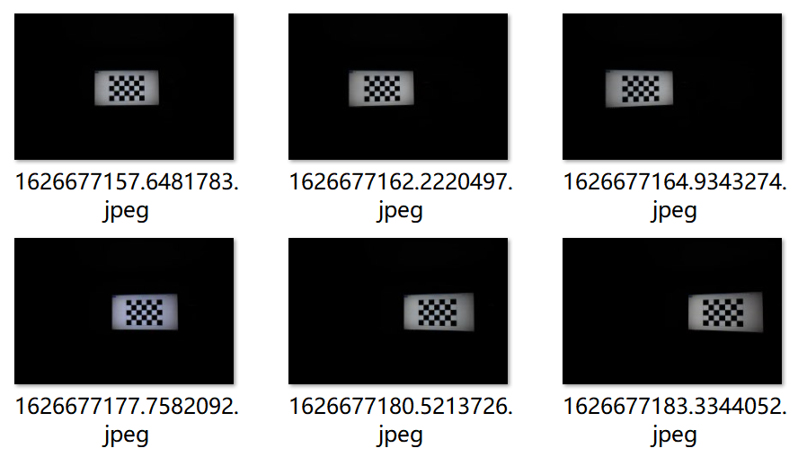
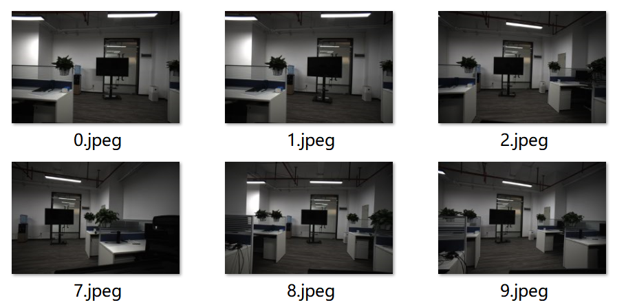

[toc]

# DeepStream: A Demo for LiDAR-RGB Fusion

## 概述

DeepStream 是一个基于Livox Horizon激光雷达和海康工业相机开发的多传感器融合测试平台。该平台当前的主要功能是：融合来自激光雷达和彩色相机的数据。基于该平台，后续可以进行多传感器融合的实验，例如：目标检测、人体跟踪、人体行为识别等。


## 依赖环境安装

- 操作系统：Ubuntu 20.04，zsh（建议安装 oh-my-zsh）

- 自行搜索安装 PyQT5，ROS noetic，anaconda3 (python3.6.13)

- Livox 激光雷达驱动：请按照[文档说明](https://github.com/Livox-SDK/livox_ros_driver)安装 Livox激光雷达驱动，在激光雷达的驱动安装目录下会生成

  ```bash
  |--- path_to_livox_driver/
  	|--- devel/
  	|--- src/
  	|--- build/
  ```

  进入 src/目录下将`livox_ros_driver/launch/livox_lidar.launch` 中“xfer_format” 配置为 2 （具体说明请参考livox驱动说明）

- 海康工业相机驱动安装：https://www.hikrobotics.com/machinevision/service/download?module=0 在官网下载“机器视觉工业相机客户端MVS V2.1.0 (Linux)”并解压下载的zip压缩包

  根据需要选择对应的版本安装，例如选择 “MVS-2.1.0_x86_64_20201228.deb”安装：

  ```bash
  sudo dpkg -i MVS-2.1.0_x86_64_20201228.deb
  ```

  注: 安装后Python例程文件会出现在 `/opt/MVS/Samples/64/Python/`，请确认路径是否一致，否则需要修改`path_to_deepstream/deepstream/hik_cam/hik_cam_linux.py`中对应的import路径


## 传感器标定

参考[官方文档](https://github.com/Livox-SDK/livox_camera_lidar_calibration/blob/master/doc_resources/README_cn.md#%E6%AD%A5%E9%AA%A42-%E7%9B%B8%E6%9C%BA%E5%86%85%E5%8F%82%E6%A0%87%E5%AE%9A)

### 硬件要求



- [Livox Horizon 激光雷达](https://www.livoxtech.com/horizon)
- [海康工业相机MV-CE060-10UC](https://www.hikrobotics.com/vision/visioninfo.htm?type=42&oid=2627) + 沃乐斯 4mm镜头  
- [NVIDIA Jetson Xavier NX开发板](https://www.nvidia.com/en-us/autonomous-machines/embedded-systems/jetson-xavier-nx/)(或PC)


### 激光雷达与相机连接

自行设计激光雷达与相机连接的底座，并通过某宝的亚克力板定制。


为了减少在标定时参数的调整，本次标定的硬件安装方式参考官方文档，最终选择如下方式：




### 相机内参的标定

本次标定选择了黑暗条件下的85寸电视来显示标定图片，一共采集了35帧各个角度的图片：




### 激光雷达与相机的联合标定

本次标定选择1m x 1.5m的黑色电视作为标定板。拍摄距离在3米左右。



注意：在采集标定板点云数据时，需要叠加多个frame的点云数据，bag文件录制10s左右，否则会极大影响标定精度。


### 标定参数的使用

得到的参数存于 params 文件夹下：

```
├─params
│  ├─intrinsic.txt
│  ├─extrinsic.txt
│  └─distort.txt
├─README.md
```


**示例参数：**

- distort.txt

```
-0.09732168794279916 0.1023514279653091 0.0003060722976587038 0.0004451042048329594 -0.01596420627741748 
```

- intrinsic.txt

```
1723.253969255113 0 1521.018607274423 0 0 1723.714922079786 1029.277181487616 0 0 0 1 0
```

- extrinsic.txt

```
0.0151031  -0.999863  -0.0068105  -0.0239579 -0.01768  0.00654316  -0.999822  0.0519217 0.99973  0.0152208  -0.0175788  -0.0108779 0  0  0
```


## 运行步骤

- 打开linux命令行终端，启动ros

- ```bash
  roscore
  ```

- 将电脑与海康相机通过USB相连

- 将电脑与激光雷达的网口相连 （激光雷达连接说明请参考激光雷达相关文档，主要是将电脑的IP修改为 192.168.1.50）

- 运行激光雷达驱动

  ```bash
  cd path_to_livox_driver/
  source devel/setup.zsh # 如果使用bash，则命令是 devel/setup.bash
  roslaunch livox_ros_driver livox_lidar_msg.launch
  ```

- 注意修改`deepstream/hik_cam.py`中海康相机驱动相关库的路径

  ```python
  # append dll path
  ## 嵌入式平台 aarch64架构
  #sys.path.append("/opt/MVS/Samples/aarch64/Python/MvImport") 
  ## 64位linux系统
  sys.path.append("/opt/MVS/Samples/64/Python/MvImport") #
  ```
  
  
  
- 运行主程序。如果是在NVIDIA开发板上运行，选择**双核**运行模式，否则会造成卡顿。

  ```
  python3 application.py
  ```


## 效果展示

- Bilibili 链接：https://www.bilibili.com/video/BV1uf4y1L7Jf?spm_id_from=333.337.search-card.all.click


## 合作开发者

- [Iris](https://github.com/iris0329)

